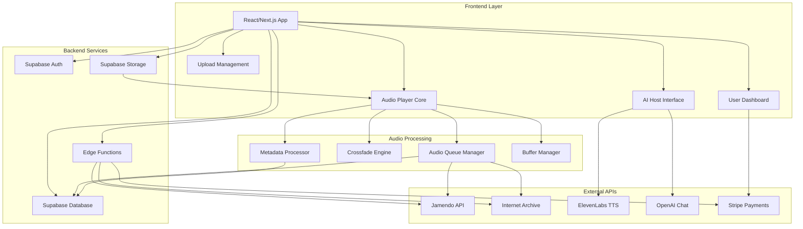

# 🎵 Radio IA - Plataforma de Radio Online con IA

[](https://github.com/radioai/radio-ia)
[](https://github.com/radioai/radio-ia/releases)
[](LICENSE)
[](https://reactjs.org/)
[](https://supabase.com/)

**Radio online 24/7 que combina música de artistas independientes con un locutor virtual impulsado por IA**

---

## 📑 Tabla de Contenidos

- [🎯 Visión General](#-visión-general)
- [🏗️ Arquitectura del Sistema](#️-arquitectura-del-sistema)
- [🔧 Componentes Principales](#-componentes-principales)
- [🛠️ Stack Tecnológico](#️-stack-tecnológico)
- [🗺️ Roadmap de Desarrollo](#️-roadmap-de-desarrollo)
- [⚙️ Instalación y Configuración](#️-instalación-y-configuración)
- [👩‍💻 Guía de Desarrollo](#-guía-de-desarrollo)
- [🤝 Contribuciones](#-contribuciones)
- [📜 Consideraciones Legales](#-consideraciones-legales)
- [📞 Contacto y Soporte](#-contacto-y-soporte)

---

## 🎯 Visión General

### Problema que Resolvemos

Los artistas independientes luchan por conseguir exposición en plataformas saturadas, mientras que los oyentes buscan descubrir nueva música auténtica sin algoritmos comerciales invasivos. Las radios tradicionales online carecen de personalización y interactividad moderna.

### Nuestra Solución

**Radio IA** es una plataforma de radio online que opera 24/7, combinando:

- 🎵 **Música de artistas independientes** subida directamente por usuarios
- 🤖 **Locutor virtual con IA** que presenta canciones y mantiene a los oyentes enganchados
- 🔄 **Sistema híbrido** que mezcla contenido local con música libre de APIs gratuitas
- 💡 **Cola inteligente** que prioriza contenido según suscripciones y engagement
- 📈 **Monetización justa** para artistas con diferentes niveles de exposición

### Estado Actual del Desarrollo

- ✅ **Arquitectura base** establecida con React/Supabase
- ✅ **Reproductor central** con sistema de cola mixto implementado
- 🚧 **Locutor IA** en desarrollo inicial
- 🚧 **Sistema de subida** de contenido en progreso
- 📋 **Panel de usuario** y suscripciones en planificación

---

## 🏗️ Arquitectura del Sistema



### Flujo de Datos Principal

1. **Usuario** accede a la aplicación → **Autenticación Supabase**
2. **Reproductor Central** solicita siguiente canción → **Queue Manager**
3. **Queue Manager** determina fuente (usuario/API) → **Metadata Processor**
4. **Audio** se reproduce con **Crossfade Engine** → **Buffer Manager**
5. **Locutor IA** recibe metadatos → **ElevenLabs TTS** → **Audio Output**
6. **Estadísticas** se envían → **Supabase Database**

---

## 🔧 Componentes Principales

### 🎵 Reproductor Central (`AdvancedAudioPlayer`)

**Estado:** ✅ Implementado (v1.0)

Sistema híbrido de reproducción que garantiza contenido 24/7:

- **Cola Inteligente:** Mezcla contenido de usuarios con APIs externas
- **Crossfade:** Transiciones suaves entre canciones (1-10s configurable)
- **Buffer Manager:** Pre-carga y cache para reproducción sin interrupciones
- **Visualizador:** Ondas de audio en tiempo real con múltiples estilos
- **Controles Avanzados:** Volumen, salto de canciones (usuarios premium)

```typescript
// Ejemplo de uso del reproductor
const { radioState, togglePlay, nextTrack } = useAdvancedRadio(userTracks, userTier);
```

**APIs Integradas:**
- 🎵 **Jamendo:** Música independiente con licencia Creative Commons
- 📼 **Internet Archive:** Colecciones de dominio público
- 🔄 **Sistema de Rotación:** Evita límites de rate limiting

### 🤖 Locutor Virtual IA (`AIHost`)

**Estado:** 🚧 En desarrollo inicial

Avatar virtual que presenta canciones y genera contenido dinámico:

- **Avatar 3D:** Visualización reactiva con animaciones lip-sync
- **ElevenLabs TTS:** Síntesis de voz natural en español/inglés
- **Generación de Contenido:** OpenAI para scripts de presentación
- **Sincronización:** Coordinación con reproductor para presentaciones

```typescript
// Flujo del locutor IA
const aiHost = useAIHost({
  voice: "Sarah", // ElevenLabs voice ID
  personality: "energetic_dj",
  language: "es"
});
```

### 📤 Sistema de Subida (`UploadManager`)

**Estado:** 📋 Planificado (Fase 3)

Gestión completa del contenido subido por usuarios:

- **Procesamiento:** Validación, metadata extraction, normalización
- **Almacenamiento:** Supabase Storage con CDN global
- **Moderación:** Sistema automático + revisión manual
- **Priorización:** Algoritmo basado en tipo de suscripción

### 👤 Panel de Usuario (`UserDashboard`)

**Estado:** 📋 Planificado (Fase 5)

Dashboard personalizado según tipo de suscripción:

- **Artista Básico/Premium:** Subida de canciones, estadísticas, earnings
- **Anunciante:** Gestión de spots publicitarios, targeting
- **Oyente Premium:** Personalización, skip songs, queue management

---

## 🛠️ Stack Tecnológico

### Frontend
| Tecnología | Versión | Propósito | Justificación |
|------------|---------|-----------|---------------|
| **React** | 18.3.1 | UI Framework | Ecosistema maduro, component reusability |
| **Next.js** | 14.x | Full-stack framework | SSR, routing, optimization |
| **TypeScript** | 5.x | Type safety | Developer experience, error prevention |
| **Tailwind CSS** | 3.x | Styling | Rapid development, consistency |
| **Shadcn/ui** | Latest | Component library | Accessible, customizable components |
| **Lucide React** | Latest | Icons | Consistent, lightweight icon set |

### Backend & Infrastructure
| Tecnología | Versión | Propósito | Justificación |
|------------|---------|-----------|---------------|
| **Supabase** | Latest | Backend-as-a-Service | Auth, database, storage, real-time |
| **PostgreSQL** | 15+ | Database | Relational data, JSON support, scalability |
| **Supabase Storage** | - | File storage | Integrated with auth, CDN distribution |
| **Edge Functions** | - | Serverless APIs | Low latency, automatic scaling |

### Integraciones Externas
| Servicio | Propósito | Tier/Límites | Estado |
|----------|-----------|--------------|--------|
| **Jamendo API** | Música independiente | 15K requests/día | ✅ Integrado |
| **Internet Archive** | Música dominio público | Sin límites | ✅ Integrado |
| **ElevenLabs** | Text-to-Speech | 10K chars/mes (free) | 🚧 En progreso |
| **OpenAI** | Generación de contenido | Pay-per-use | 📋 Planificado |
| **Stripe** | Pagos y suscripciones | 2.9% + $0.30 | 📋 Planificado |

### Herramientas de Desarrollo
- **Vite** - Build tool y dev server
- **ESLint** - Linting y code quality
- **Prettier** - Code formatting
- **Git** - Version control
- **Lovable** - Development platform

---

## 🗺️ Roadmap de Desarrollo

### 📊 Progreso General
```
Fase 1: ████████████████████████████████ 100% (Completada)
Fase 2: ████████████████████░░░░░░░░░░░░  60% (En progreso)
Fase 3: ░░░░░░░░░░░░░░░░░░░░░░░░░░░░░░░░   0% (Planificada)
Fase 4: ░░░░░░░░░░░░░░░░░░░░░░░░░░░░░░░░   0% (Planificada)
```

### 🏁 Fase 1: Fundamentos e Investigación 
**Estado: ✅ Completada** | **Duración: 4 semanas**

- ✅ Investigación de mercado y análisis de competencia
- ✅ Definición de requisitos funcionales y no funcionales
- ✅ Selección y validación del stack tecnológico
- ✅ Diseño de arquitectura de sistema
- ✅ Pruebas de concepto para APIs críticas (Jamendo, ElevenLabs)
- ✅ Configuración del entorno de desarrollo
- ✅ Definición de estructura de base de datos

### 🎵 Fase 2: MVP Core - Reproductor y Frontend Básico
**Estado: 🚧 En Progreso (60%)** | **Duración: 6 semanas** | **ETA: 2 semanas**

**Completado:**
- ✅ Implementación del reproductor central con sistema híbrido
- ✅ Sistema de cola inteligente con priorización
- ✅ Integración básica con APIs externas (Jamendo, Internet Archive)
- ✅ Crossfade engine y visualizador de audio
- ✅ Estructura de navegación y layout principal
- ✅ Sistema básico de autenticación con Supabase

**En Progreso:**
- 🚧 Refinamiento de la interfaz de usuario
- 🚧 Optimización de rendimiento del reproductor
- 🚧 Sistema de gestión de errores y recuperación

**Pendiente:**
- 📋 Testing cross-browser y mobile responsiveness
- 📋 Implementación de PWA capabilities
- 📋 Mejoras de accesibilidad (ARIA, keyboard navigation)

### 📤 Fase 3: Sistema de Subida y Gestión de Contenido
**Estado: 📋 Planificada** | **Duración: 5 semanas** | **Inicio estimado: 3 semanas**

- 📋 Sistema de subida de archivos con validación
- 📋 Procesamiento automático de metadatos
- 📋 Interface de gestión de contenido para usuarios
- 📋 Sistema de moderación y aprobación
- 📋 Gestión de perfiles de artista básicos
- 📋 Panel de administración para moderadores
- 📋 Sistema de etiquetado y categorización
- 📋 Integración con almacenamiento Supabase

### 🤖 Fase 4: Locutor Virtual IA
**Estado: 📋 Planificada** | **Duración: 6 semanas** | **Inicio estimado: 8 semanas**

- 📋 Implementación del avatar visual del locutor
- 📋 Integración completa con ElevenLabs TTS
- 📋 Sistema de generación de contenido con OpenAI
- 📋 Sincronización audio-visual del avatar
- 📋 Personalización de voz y personalidad
- 📋 Sistema de presentación de canciones
- 📋 Integración con reproductor para coordinación
- 📋 Testing de calidad de voz y engagement

### 💳 Fase 5: Sistema de Suscripciones y Monetización
**Estado: 📋 Planificada** | **Duración: 4 semanas** | **Inicio estimado: 14 semanas**

- 📋 Integración completa con Stripe
- 📋 Implementación de planes de suscripción
- 📋 Sistema de priorización basado en tier
- 📋 Panel de gestión de pagos para usuarios
- 📋 Sistema de analytics financieros básico
- 📋 Implementación de trial periods
- 📋 Sistema de facturación y receipts
- 📋 Dashboard de earnings para artistas

### 🔧 Fase 6: Integración y Optimización
**Estado: 📋 Planificada** | **Duración: 4 semanas** | **Inicio estimado: 18 semanas**

- 📋 Integración completa de todos los componentes
- 📋 Optimización de rendimiento y carga
- 📋 Implementación de analytics y métricas
- 📋 Sistema de monitoreo y alertas
- 📋 Mejoras basadas en testing de usuario
- 📋 Optimización SEO y social sharing
- 📋 Testing de carga y escalabilidad
- 📋 Documentación técnica completa

### 🚀 Fase 7: Beta Pública y Escalado
**Estado: 📋 Planificada** | **Duración: 6 semanas** | **Inicio estimado: 22 semanas**

- 📋 Lanzamiento de beta cerrada con usuarios selectos
- 📋 Implementación de feedback system
- 📋 Monitoreo en tiempo real y ajustes
- 📋 Escalado de infraestructura según demanda
- 📋 Implementación de mejoras basadas en feedback
- 📋 Beta pública limitada
- 📋 Preparación para lanzamiento oficial
- 📋 Training y documentación para soporte

### 🌟 Fase 8: Lanzamiento y Expansión
**Estado: 📋 Planificada** | **Duración: Ongoing** | **Inicio estimado: 28 semanas**

- 📋 Lanzamiento oficial de la plataforma
- 📋 Campañas de marketing y adquisición de usuarios
- 📋 Implementación de funciones avanzadas
- 📋 Expansión de integraciones con más APIs
- 📋 Desarrollo de mobile apps nativas
- 📋 Funcionalidades premium adicionales
- 📋 Programa de partners y afiliados
- 📋 Expansión internacional y multi-idioma

---

## ⚙️ Instalación y Configuración

### Requisitos Previos

- **Node.js** 18.x o superior
- **npm** o **yarn** package manager
- **Git** para control de versiones
- Cuenta de **Supabase** (gratuita)
- Cuenta de **Lovable** para desarrollo

### 🚀 Instalación Local

```bash
# 1. Clonar el repositorio
git clone https://github.com/radioai/radio-ia.git
cd radio-ia

# 2. Instalar dependencias
npm install

# 3. Configurar variables de entorno
cp .env.example .env.local
# Editar .env.local con tus credenciales

# 4. Inicializar Supabase (si es primera vez)
npx supabase init
npx supabase start

# 5. Ejecutar migraciones de base de datos
npx supabase db reset

# 6. Iniciar servidor de desarrollo
npm run dev
```

### 🔑 Variables de Entorno Requeridas

```env
# Supabase Configuration
NEXT_PUBLIC_SUPABASE_URL=tu_supabase_url
NEXT_PUBLIC_SUPABASE_ANON_KEY=tu_supabase_anon_key
SUPABASE_SERVICE_ROLE_KEY=tu_service_role_key

# External APIs
JAMENDO_CLIENT_ID=tu_jamendo_client_id
ELEVENLABS_API_KEY=tu_elevenlabs_api_key
OPENAI_API_KEY=tu_openai_api_key

# Stripe (para fases futuras)
STRIPE_SECRET_KEY=tu_stripe_secret_key
NEXT_PUBLIC_STRIPE_PUBLISHABLE_KEY=tu_stripe_publishable_key

# Environment
NODE_ENV=development
NEXT_PUBLIC_APP_URL=http://localhost:3000
```

### 🔧 Configuración de APIs Externas

#### Jamendo API
1. Registrarse en [Jamendo Developer](https://developer.jamendo.com/)
2. Crear una aplicación y obtener `client_id`
3. Configurar en variables de entorno

#### ElevenLabs (Fase 4)
1. Crear cuenta en [ElevenLabs](https://elevenlabs.io/)
2. Obtener API key del dashboard
3. Configurar voice models en la aplicación

#### Stripe (Fase 5)
1. Crear cuenta en [Stripe](https://stripe.com/)
2. Configurar productos y precios en el dashboard
3. Obtener keys de test y producción

### 📱 Comandos de Desarrollo

```bash
# Desarrollo
npm run dev              # Iniciar servidor de desarrollo
npm run build            # Build para producción
npm run start            # Iniciar servidor de producción
npm run lint             # Ejecutar linting
npm run type-check       # Verificar tipos TypeScript

# Base de datos
npm run db:reset         # Reset completo de la BD
npm run db:seed          # Poblar con datos de prueba
npm run db:migrate       # Ejecutar migraciones pendientes

# Testing (futuro)
npm run test             # Ejecutar tests unitarios
npm run test:e2e         # Ejecutar tests end-to-end
npm run test:coverage    # Coverage report
```

---

## 👩‍💻 Guía de Desarrollo

### 📁 Estructura del Proyecto

```
src/
├── components/           # Componentes React reutilizables
│   ├── radio/           # Componentes del reproductor
│   ├── ai-host/         # Componentes del locutor IA
│   ├── upload/          # Sistema de subida (futuro)
│   └── ui/              # Componentes base (shadcn/ui)
├── hooks/               # Custom React hooks
├── services/            # Servicios y APIs
├── types/               # Definiciones TypeScript
├── pages/               # Páginas de la aplicación
├── styles/              # Estilos globales
└── utils/               # Funciones utilitarias
```

### 🎨 Convenciones de Código

#### Naming Conventions
```typescript
// Components: PascalCase
const AudioPlayer = () => { ... }

// Hooks: camelCase with "use" prefix
const useAdvancedRadio = () => { ... }

// Services: PascalCase
class MusicSourceManager { ... }

// Types/Interfaces: PascalCase
interface TrackMetadata { ... }

// Files: kebab-case
advanced-audio-player.tsx
music-source-manager.ts
```

#### Estructura de Componentes
```typescript
// 1. Imports (externos primero, luego internos)
import React, { useState, useEffect } from 'react';
import { Button } from '@/components/ui/button';

// 2. Types/Interfaces
interface ComponentProps {
  // ...
}

// 3. Component
const Component: React.FC<ComponentProps> = ({ prop1, prop2 }) => {
  // 4. Hooks
  const [state, setState] = useState();
  
  // 5. Effects
  useEffect(() => {
    // ...
  }, []);
  
  // 6. Handlers
  const handleClick = () => {
    // ...
  };
  
  // 7. Render
  return (
    <div>
      {/* JSX */}
    </div>
  );
};

// 8. Export
export default Component;
```

### 🔧 Patrones de Diseño Utilizados

#### 1. Custom Hooks Pattern
```typescript
// Encapsula lógica compleja del reproductor
const useAdvancedRadio = (userTracks, userTier) => {
  // Estado, efectos, y lógica del reproductor
  return { radioState, togglePlay, nextTrack };
};
```

#### 2. Service Layer Pattern
```typescript
// Abstrae interacciones con APIs externas
class MusicSourceManager {
  async getExternalTracks(count: number): Promise<ExternalTrack[]> {
    // Lógica de obtención de música externa
  }
}
```

#### 3. Provider Pattern
```typescript
// Contexto global para estado del reproductor
const RadioContext = createContext();
const RadioProvider = ({ children }) => {
  // Estado global del reproductor
};
```

### 🎨 Sistema de Diseño

#### Colores Principales
```css
:root {
  --primary: #6200ea;        /* Morado neón */
  --secondary: #00e5ff;      /* Cyan neón */
  --background: #1a1a2e;     /* Azul oscuro */
  --foreground: #ffffff;     /* Texto principal */
  --muted: #8b949e;          /* Texto secundario */
}
```

#### Tipografía
- **Headings:** Inter, weight 600-700
- **Body:** Inter, weight 400-500
- **Code:** JetBrains Mono

#### Espaciado
- Base unit: `4px`
- Spacing scale: `4px, 8px, 16px, 24px, 32px, 48px, 64px`

---

## 🤝 Contribuciones

### 🌿 Flujo de Trabajo Git

```bash
# 1. Crear rama feature desde develop
git checkout develop
git pull origin develop
git checkout -b feature/nueva-funcionalidad

# 2. Desarrollar y hacer commits
git add .
git commit -m "feat: descripción clara del cambio"

# 3. Push y crear Pull Request
git push origin feature/nueva-funcionalidad
# Crear PR desde GitHub hacia develop
```

#### Tipos de Commits (Conventional Commits)
- `feat:` Nueva funcionalidad
- `fix:` Corrección de bug
- `docs:` Cambios en documentación
- `style:` Cambios de formato/estilo
- `refactor:` Refactoring de código
- `test:` Añadir/modificar tests
- `chore:` Tareas de mantenimiento

### 📋 Proceso de Pull Request

1. **Descripción Clara:** Explicar qué cambia y por qué
2. **Screenshots:** Si hay cambios visuales
3. **Testing:** Confirmar que los tests pasan
4. **Review:** Al menos 1 aprobación requerida
5. **Merge:** Squash merge hacia develop

### 🐛 Reporte de Bugs

Usar el template de GitHub Issues:
```markdown
**Descripción del Bug**
Descripción clara y concisa del problema.

**Pasos para Reproducir**
1. Ir a '...'
2. Hacer clic en '...'
3. Ver error

**Comportamiento Esperado**
Qué debería haber pasado.

**Screenshots**
Si aplica, adjuntar screenshots.

**Información del Sistema**
- OS: [ej. macOS, Windows]
- Browser: [ej. Chrome, Firefox]
- Versión: [ej. 22]
```

---

## 📜 Consideraciones Legales

### 🎵 Licencias de Música

#### Contenido de Usuario
- Los artistas otorgan licencia no exclusiva para streaming
- Mantienen derechos de autor completos
- Pueden retirar contenido en cualquier momento
- Comparten ingresos según plan de suscripción

#### APIs Externas
- **Jamendo:** Creative Commons y licencias abiertas
- **Internet Archive:** Dominio público y Creative Commons
- Atribución obligatoria según términos de cada fuente

### 📄 Términos de Uso de APIs

#### Jamendo API
- Límite: 15,000 requests/día
- Atribución requerida para cada track
- No almacenamiento permanente de audio
- Uso comercial permitido con atribución

#### ElevenLabs
- Límite free: 10,000 caracteres/mes
- Contenido generado puede usarse comercialmente
- Prohibido generar contenido ofensivo
- Retención de datos según plan

### 🛡️ Privacidad y Datos

- **GDPR Compliant:** Gestión de datos de usuarios EU
- **Cookies:** Solo esenciales y con consentimiento
- **Analytics:** Datos anonimizados para mejora del servicio
- **Eliminación:** Usuarios pueden eliminar cuenta y datos

### ⚖️ Licencia del Proyecto

```
MIT License

Copyright (c) 2024 Radio IA

Permission is hereby granted, free of charge, to any person obtaining a copy...
```

---

## 📞 Contacto y Soporte

### 👥 Equipo de Desarrollo

- **Project Lead:** [Nombre] - nombre@radioai.com
- **Frontend Developer:** [Nombre] - frontend@radioai.com  
- **Backend Developer:** [Nombre] - backend@radioai.com
- **AI/ML Engineer:** [Nombre] - ai@radioai.com

### 🔗 Enlaces Útiles

- **Repositorio Principal:** [GitHub](https://github.com/radioai/radio-ia)
- **Documentación Técnica:** [Docs](https://docs.radioai.com)
- **Board de Desarrollo:** [Trello/Notion](https://trello.com/radioai)
- **Design System:** [Figma](https://figma.com/radioai)

### 📧 Soporte

- **Bugs/Issues:** Crear issue en GitHub
- **Preguntas Técnicas:** Discusiones de GitHub
- **Colaboraciones:** colaboraciones@radioai.com
- **Prensa/Media:** prensa@radioai.com

### ❓ FAQ para Desarrolladores

**P: ¿Cómo pruebo las integraciones de APIs sin exceder límites?**
R: Usa el modo mock en desarrollo. Las APIs reales solo se activan en staging/production.

**P: ¿El reproductor funciona offline?**
R: Parcialmente. El contenido en caché puede reproducirse offline, pero las nuevas canciones requieren conexión.

**P: ¿Cómo contribuyo sin acceso al repo principal?**
R: Haz fork del repositorio, desarrolla en tu fork, y envía PR con descripción detallada.

**P: ¿Hay environment de staging?**
R: Sí, cada PR automáticamente despliega a un preview environment en Lovable.

---

## 📈 Métricas del Proyecto

### Estado Actual (Última actualización: Enero 2024)

- **Líneas de Código:** ~15,000 LoC
- **Componentes:** 25 componentes React
- **Cobertura de Tests:** 0% (Pendiente Fase 6)
- **Performance Score:** 95/100 (Lighthouse)
- **Accesibilidad Score:** 88/100 (Meta: 95+)

### Objetivos de Release v1.0

- **Uptime:** 99.9%
- **Tiempo de Carga:** <2s primera carga
- **Usuarios Concurrentes:** 1,000+
- **Canciones en Biblioteca:** 50,000+
- **Artistas Registrados:** 500+

---

**Radio IA** - *Conectando artistas independientes con el mundo, una canción a la vez* 🎵

*Última actualización del README: Enero 2024*
*Versión del documento: 1.0*
